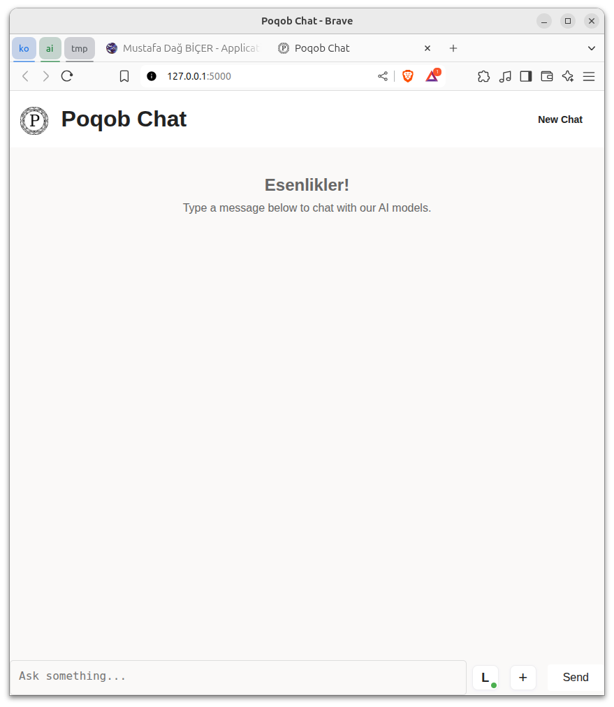
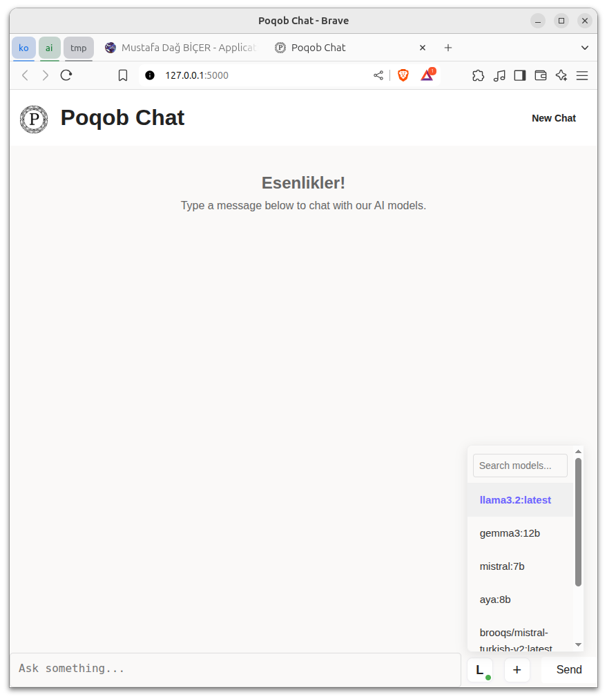
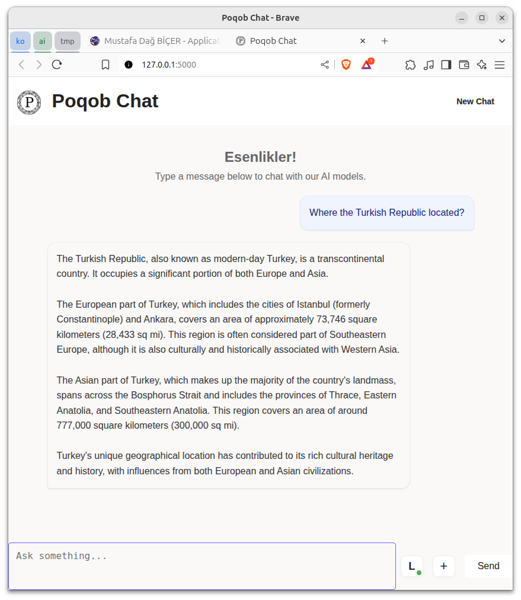
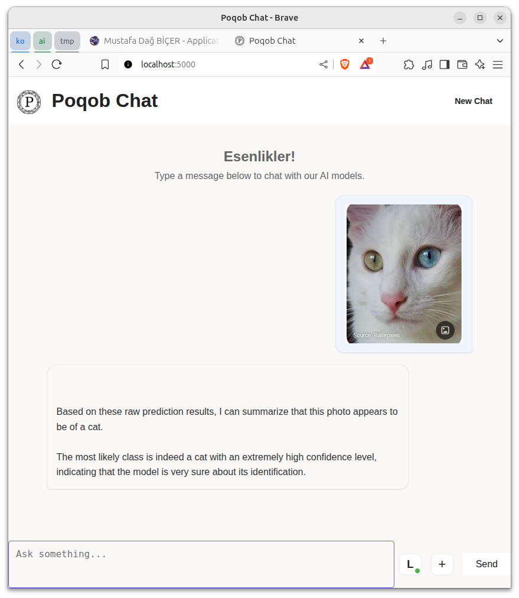
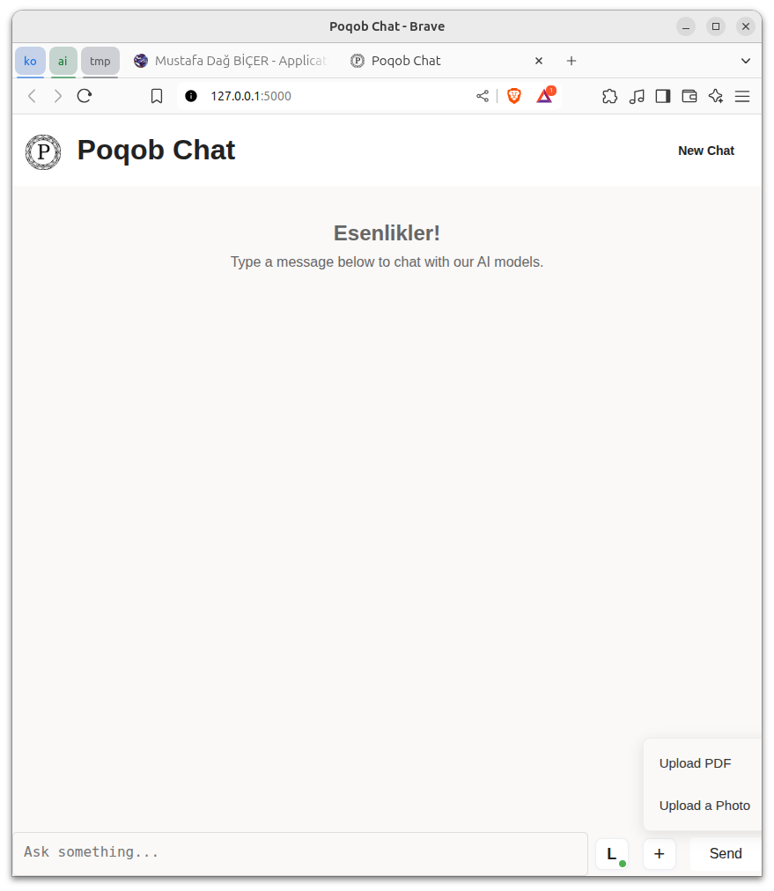
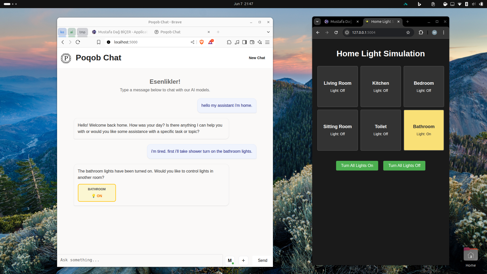

# Ollama Flask API

A modular Flask application providing a web interface for Large Language Model (LLM) chat, regression analysis, and image classification, with real-time streaming and AI-powered explanations. The project integrates multiple AI services and offers a modern, responsive frontend for both text and image-based interactions.

## Features

- **LLM Chat Interface**: Chat with LLMs (via Ollama API) using a web UI with Markdown rendering and real-time streaming responses.
- **Regression Analysis**: Query regression models directly or via natural language, with LLM-generated explanations for results.
- **Image Classification**: Upload images for classification and receive detailed, non-technical explanations from an LLM.
- **Streaming Support**: Both chat and image analysis support real-time streaming, allowing users to stop generation at any time.
- **Home Lights Control**: Control simulated home lights via chat or API, including natural language commands.
- **Mobile Responsive**: The web interface is designed for both desktop and mobile devices.
- **Extensible Architecture**: Easily add new ML/AI services or UI features.

## Screenshots

### Home Page Interface

*The main interface of the application showing the chat UI with model selection options.*

### Language Models List

*Available language models that can be selected for chat and explanation generation.*

### Query Interface

*The chat interface showing a conversation with the selected language model.*

### Image Prediction

*Image classification interface with AI-generated explanations of the uploaded image.*

### Extensions List

*Available extensions that can be used with the application.*

### Home Lights Simulation Example

*The home lights simulation extension interface for controlling virtual home lighting.*

## Video Tutorial

A comprehensive video tutorial on how to set up and use this project is available on YouTube:
[Poqob Chat Tutorial](https://www.youtube.com/watch?v=LiNRWBQKF_Y)

The video covers installation, configuration, and usage of all the features in this application.

## Architecture Overview

- **Flask Backend**: Orchestrates API routing, service integration, and CORS.
- **Ollama Integration**: Connects to Ollama LLM API (default port 11434) for chat and text generation.
- **Regression Service**: External ML service (default port 5001) for regression predictions.
- **Image Classification Service**: External ML service (default port 5003) for image analysis and explanations.
- **Web Frontend**: Modern, responsive UI with chat and image analysis tabs, model selection, and real-time feedback.

## API Endpoints

### LLM Endpoints
- `GET /api/models`: List available models
- `POST /api/generate`: Generate text
- `POST /api/generate/stream`: Generate text (streaming)
- `POST /api/chat`: Chat completion
- `POST /api/chat/stream`: Chat completion (streaming)

### Regression Endpoints
- `POST /api/regression/predict`: Predict from structured data
- `POST /api/regression/predict_from_text`: Predict from natural language
- `GET /api/regression/status`: Check regression service status

### Image Endpoints
- `POST /api/image/predict`: Image classification
- `POST /api/image/predict_with_explanation`: Classification + LLM explanation
- `POST /api/image/predict_with_explanation/stream`: Streaming explanation

### Home Lights Endpoints
- `GET /api/lights/status`: Check lights service
- `POST /api/lights/control`: Control lights (structured)
- `POST /api/lights/control_from_text`: Control lights (natural language)

> All endpoints also work without the `/api/` prefix for backward compatibility.

## Usage Examples

### Chat with LLM
Send a message via the web UI or:
```bash
curl -X POST http://localhost:5000/api/chat -H "Content-Type: application/json" -d '{"model": "llama3.2:latest", "messages": [{"role": "user", "content": "Hello!"}]}'
```

### Regression Prediction
```bash
curl -X POST http://localhost:5000/api/regression/predict -H "Content-Type: application/json" -d '{"age": 30, "sex": "male", "bmi": 25.0, "children": 1, "smoker": "no", "region": "northeast", "model": "random_forest"}'
```

### Image Classification with Explanation
```bash
curl -X POST http://localhost:5000/api/image/predict_with_explanation -F "image=@path/to/image.jpg" -F "model=llama3.2:latest"
```

### Home Lights Control
```bash
curl -X POST http://localhost:5000/api/lights/control_from_text -H "Content-Type: application/json" -d '{"text": "Turn on the living room lights", "model": "llama3.2:latest"}'
```

## Setup

1. Install dependencies:
   ```bash
   pip install -r requirements.txt
   ```
2. Start the Flask app:
   ```bash
   python run.py
   ```
3. Open [http://localhost:5000](http://localhost:5000) in your browser.
4. Ensure the following services are running:
   - Ollama API (port 11434)
   - Regression service (port 5001)
   - Image classification service (port 5003)

## Configuration

- **Backend**: Edit `config.py` for API hosts, ports, default model, and CORS.
- **Frontend**: Edit `static/config.js` for API paths, default model, and UI settings.

## Requirements

- Python 3.8+
- Flask, Flask-CORS, Requests
- Ollama (with models like `llama3.2:latest` installed)
- Regression and image classification services (see `/extensions` for examples)

## Extending the Project

- Add new ML/AI services by creating new endpoints and updating the frontend as needed.
- Customize the UI via `static/` files (HTML, CSS, JS).
- See `/extensions` for example ML services (e.g., dogs-cats classifier, home lights simulation).

## Future Development

- User authentication and session management
- More LLM model support and dynamic model loading
- Enhanced mobile UI and accessibility
- Comprehensive unit and integration tests
- Performance optimizations for large images and complex queries

## License

MIT License
